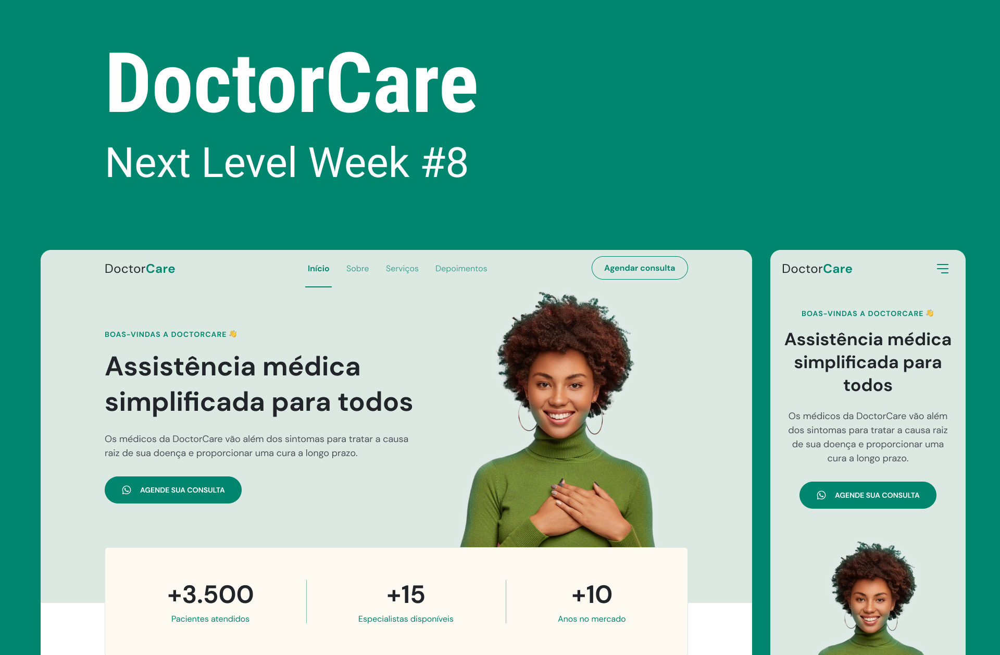

# DoctorCare | NLW - Rocketseat

<div align="center">

[](https://opensource.org/licenses/MIT)
[](https://html.spec.whatwg.org/)
[](https://www.w3.org/Style/CSS/)
[](https://developer.mozilla.org/pt-BR/docs/Web/JavaScript)
[](https://github.com/otavioaugust1/DoctorCare_NLW)

</div>

<br>

<div align="center">
	
</div>

## 🩺 Sobre o Projeto

**DoctorCare** é uma Landing Page moderna e responsiva desenvolvida durante a **NLW (Next Level Week) #8** da [Rocketseat](https://www.rocketseat.com.br/), focada em criar uma experiência profissional para uma clínica médica.

Neste projeto foi aplicado:
- ✅ HTML5 semântico com melhor acessibilidade (WAI-ARIA)
- ✅ CSS3 com mobile-first, variáveis e media queries
- ✅ JavaScript ES6+ com comentários explicativos
- ✅ Animações com ScrollReveal.js
- ✅ Design responsivo (mobile, tablet, desktop)
- ✅ Código moderno e boas práticas de desenvolvimento

## 🚀 Tecnologias

| Tecnologia | Descrição |
|-----------|-----------|
| **HTML5** | Estrutura semântica e acessível |
| **CSS3** | Layouts com Flexbox, variáveis CSS, media queries |
| **JavaScript ES6+** | Interatividade, menu mobile, smooth scroll |
| **ScrollReveal.js** | Animações de entrada ao rolar a página |
| **Google Fonts** | Tipografia DM Sans (400, 700 pesos) |

## 📁 Estrutura do Projeto

```
DoctorCare_NLW/
├── index.html          # Página principal com estrutura HTML5
├── style.css           # Estilos com mobile-first e responsividade
├── main.js             # Scripts comentados para interatividade
├── assets/             # Ícones e logos (SVG)
│   ├── logo_b.svg      # Logo com fundo
│   ├── logo_w.svg      # Logo branca (footer)
│   ├── icon_m.svg      # Ícone de menu mobile
│   └── foto.svg        # Ilustração da médica
├── img/                # Imagens do projeto
│   └── Capa.png        # Mockup/capa do projeto
└── README.md           # Este arquivo
```

## 💻 Como Usar

### Opção 1: Abrir localmente
1. Clone o repositório:
```bash
git clone https://github.com/otavioaugust1/DoctorCare_NLW.git
cd DoctorCare_NLW
```

2. Abra `index.html` no navegador:
   - Clique duplo no arquivo `index.html`, ou
   - Use a extensão [Live Server](https://marketplace.visualstudio.com/items?itemName=ritwickdey.LiveServer) do VS Code

### Opção 2: Deploy
O projeto pode ser facilmente deployado em:
- [GitHub Pages](https://pages.github.com/)
- [Netlify](https://www.netlify.com/)
- [Vercel](https://vercel.com/)

## 📱 Responsividade

O layout se adapta automaticamente a diferentes tamanhos de tela:

| Dispositivo | Breakpoint |
|-------------|-----------|
| Mobile | < 768px |
| Tablet | 768px - 1199px |
| Desktop | ≥ 1200px |

## ✨ Funcionalidades

- 🎨 **Navbar fixa** com mudança de estilo ao rolar
- 📱 **Menu mobile** (hamburguer) responsivo
- ⬇️ **Smooth scroll** para navegação entre seções
- 🎬 **Animações** com ScrollReveal ao entrar em viewport
- 📞 **Botões CTA** com links para WhatsApp e agendamento
- ♿ **Acessibilidade** melhorada (ARIA labels, semântica HTML)
- 🎯 **Mobile-first** design com CSS moderno

## 🔧 Funcionalidades JavaScript

Todos os scripts estão bem comentados:

- **setupNavScroll()** - Troca cor da navbar ao rolar
- **setupMobileMenu()** - Toggle do menu mobile com hamburger
- **setupSmoothScroll()** - Scroll suave para âncoras internas
- **setupScrollReveal()** - Inicializa animações de reveal

## 📚 Seções da Página

1. **Navbar** - Navegação fixa com menu responsivo
2. **Hero** - Seção de boas-vindas com CTA principal
3. **Estatísticas** - Números de pacientes, especialistas e anos
4. **Sobre** - Descrição da clínica e missão
5. **Serviços** - 3 principais serviços oferecidos
6. **Depoimentos** - Feedback de pacientes
7. **Agendar** - CTA final com botão de agendamento
8. **Footer** - Informações e links rápidos

## 🎓 Aprendizados - NLW Rocketseat

Este projeto foi desenvolvido seguindo a trilha **Origin** da NLW #8, com aplicação de:
- Estruturas HTML semânticas
- Layouts responsivos com Flexbox e Grid
- CSS custom properties (variáveis)
- JavaScript vanilla sem frameworks
- Boas práticas de acessibilidade
- Mobile-first design approach

## 👨‍💻 Autor

**Nome:** Otavio Augusto

**Email:** otavioaugust@gmail.com

**GitHub:** [@otavioaugust1](https://github.com/otavioaugust1)

**Versão:** 0.2.1

---

## 📄 Licença

Este projeto está licenciado sob a **Licença MIT**.

Você é livre para:
- ✅ Usar em projetos comerciais ou pessoais
- ✅ Modificar e adaptar o código
- ✅ Distribuir e compartilhar

Com a condição de manter o aviso de licença e atribuição.

Veja o arquivo [LICENSE](LICENSE) para mais detalhes.

---

<div align="center">

**Desenvolvido com ❤️ durante a NLW - Rocketseat**

Made with 💚 by [Otavio Augusto](https://github.com/otavioaugust1)

</div>
